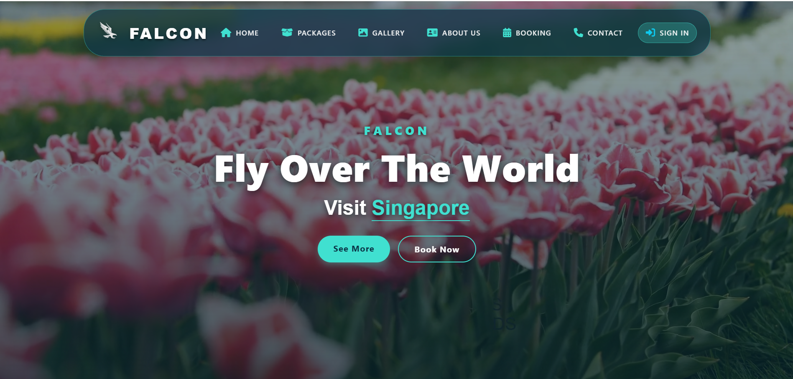
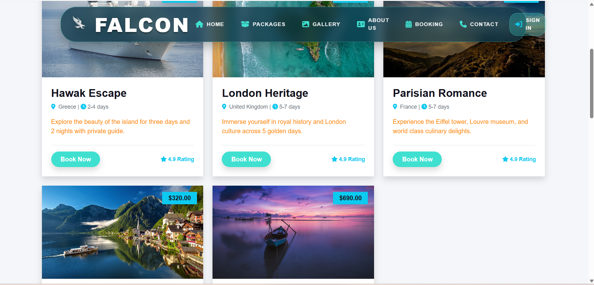
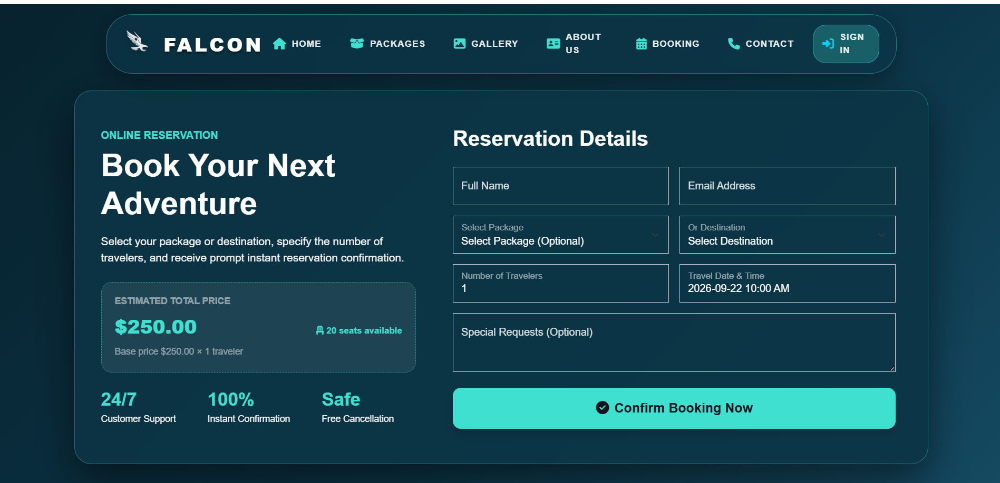
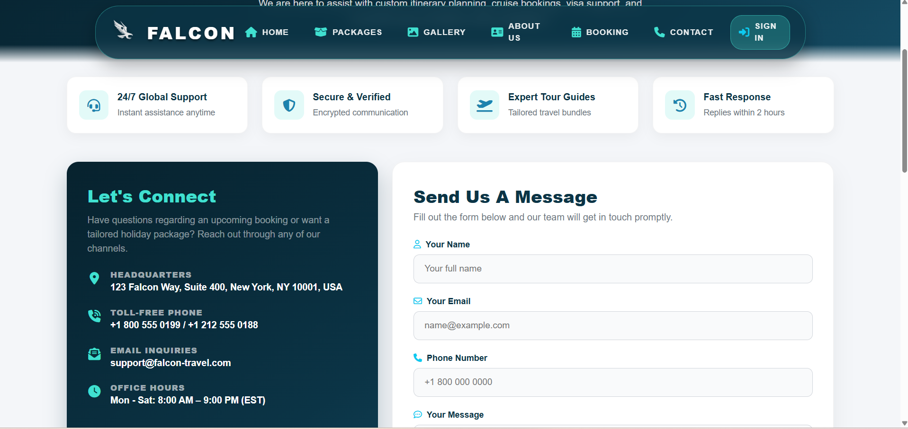
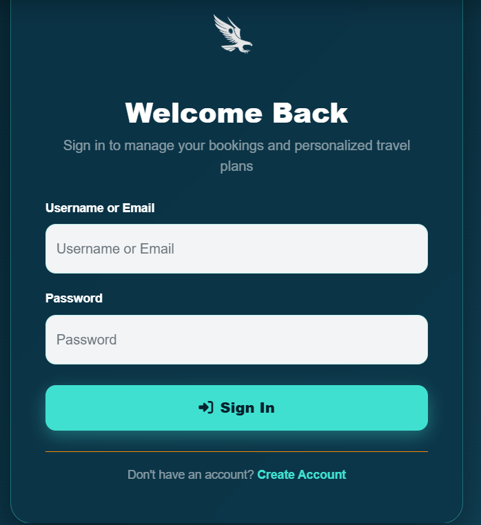
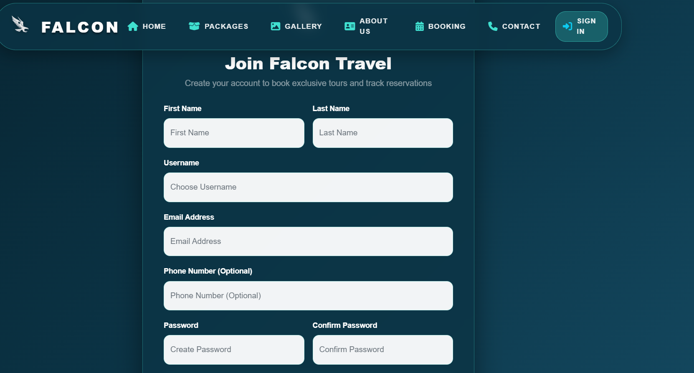

# FALCON — Travel & Tourism Booking Platform

A full-stack travel and tourism web application built with Django, Django REST Framework, and PostgreSQL. FALCON allows users to explore destinations and travel packages, create accounts, manage profiles, and submit travel bookings through a web interface and REST API.

## Live Demo

**Live Application:** https://falcon-travel-tourism.onrender.com

**GitHub Repository:** https://github.com/Sulalakv/FALCON-Travel-Tourism

> The free Render deployment may take a short time to wake up after inactivity.

## Overview

FALCON is designed as a practical travel booking platform with a Django backend and REST API layer.

### Current features

- Destination browsing
- Travel package browsing
- Package search and filtering
- User registration and login
- Email-based login support
- User profiles
- Travel booking creation
- Booking status management
- Booking cancellation
- Dynamic booking price calculation
- Package capacity tracking
- REST API endpoints
- JWT authentication for API clients
- PostgreSQL database support
- Django Admin
- Render deployment configuration

The project is actively being improved with additional backend engineering features.

## Key Features

### Destinations
- Browse travel destinations
- Popular destination classification
- Destination descriptions and images
- Destination-based package filtering

### Travel Packages
- View travel packages
- Package descriptions and locations
- Duration and pricing information
- Featured packages
- Package capacity
- Available and booked slot calculation
- Search packages by title or location

### User Authentication

The web interface uses Django session-based authentication.

The REST API additionally supports JWT authentication using `djangorestframework-simplejwt`.

JWT endpoints:

```text
POST /api/token/
POST /api/token/refresh/
```

Protected API requests use:

```text
Authorization: Bearer <access_token>
```

### Booking Management

Authenticated users can:
- Create bookings
- View their own bookings
- View booking details
- Cancel eligible bookings
- Provide special requests
- Specify number of guests
- Track booking status

Current booking statuses:

```text
pending
confirmed
completed
cancelled
```

### Dynamic Pricing

Booking totals are calculated from the selected package price and number of guests:

```text
Total Price = Package Price × Number of Guests
```

Each booking receives a unique booking code in the format:

```text
FLC-XXXXXX
```

## Technology Stack

### Backend
- Python
- Django
- Django REST Framework
- Simple JWT
- Django ORM
- PostgreSQL

### Frontend
- HTML5
- CSS3
- JavaScript
- Bootstrap
- Django Templates

### Database
- PostgreSQL for production
- SQLite can be used for local development

### Deployment
- Render
- Gunicorn
- WhiteNoise
- `dj-database-url`
- Environment variables

### Development
- Git
- GitHub
- VS Code
- Python virtual environment

## Architecture

```text
                    FALCON
                       |
              +--------+--------+
              |                 |
          Web Interface      REST API
              |                 |
        Django Templates     Django REST Framework
              |                 |
              +--------+--------+
                       |
                  Django ORM
                       |
                  PostgreSQL
```

Authentication supports:

```text
Web Application
      |
Django Session Authentication
```

and:

```text
API Client
    |
JWT Authentication
    |
Protected REST API
```

## Project Structure

```text
FALCON-Travel-Tourism/
│
├── media/
├── static/
├── staticfiles/
├── templates/
│
├── tourism/
│   ├── migrations/
│   ├── admin.py
│   ├── api_views.py
│   ├── apps.py
│   ├── auth_views.py
│   ├── forms.py
│   ├── models.py
│   ├── serializers.py
│   ├── tests.py
│   ├── urls.py
│   └── views.py
│
├── travel_agency/
│   ├── settings.py
│   ├── urls.py
│   ├── wsgi.py
│   └── ...
│
├── .env.example
├── .gitignore
├── build.sh
├── DEPLOYMENT.md
├── LICENSE
├── manage.py
├── Procfile
├── render.yaml
├── requirements.txt
├── runtime.txt
└── seed_db.py
```

## REST API

### Authentication

#### Obtain JWT Token

```http
POST /api/token/
```

Request:

```json
{
  "username": "your_username",
  "password": "your_password"
}
```

Response:

```json
{
  "refresh": "<refresh_token>",
  "access": "<access_token>"
}
```

#### Refresh Access Token

```http
POST /api/token/refresh/
```

Request:

```json
{
  "refresh": "<refresh_token>"
}
```

### Destinations

```http
GET /api/destinations/
GET /api/destinations/<id>/
```

These endpoints are publicly accessible.

### Packages

```http
GET /api/packages/
GET /api/packages/<id>/
```

Optional query parameters:

```text
?destination=Paris
?search=mountain
```

Examples:

```text
GET /api/packages/?destination=Paris
GET /api/packages/?search=mountain
```

Package responses include information such as:
- Package title
- Description
- Location
- Duration
- Price
- Destination
- Maximum capacity
- Booked slots
- Available slots
- Featured status
- Image URL

### Bookings

Booking endpoints require authentication.

```http
GET /api/bookings/
POST /api/bookings/
POST /api/bookings/<id>/cancel/
```

The booking list returns bookings belonging to the authenticated user.

Example:

```http
Authorization: Bearer <access_token>
```

### User Profile

```http
GET /api/profile/
PUT /api/profile/
```

These endpoints require authentication.

## Local Development

### 1. Clone the repository

```bash
git clone https://github.com/Sulalakv/FALCON-Travel-Tourism.git
cd FALCON-Travel-Tourism
```

### 2. Create a virtual environment

Windows:

```powershell
python -m venv venv
```

Activate it:

```powershell
.env\Scripts\Activate.ps1
```

### 3. Install dependencies

```powershell
python -m pip install -r requirements.txt
```

### 4. Configure environment variables

Create a `.env` file based on `.env.example`.

Example:

```env
SECRET_KEY=your-secret-key
DEBUG=True
DATABASE_URL=sqlite:///db.sqlite3
```

For production, use a secure secret key and PostgreSQL database URL.

> Never commit real passwords, secret keys, database credentials, API keys, or other secrets to GitHub.

### 5. Apply migrations

```powershell
python manage.py migrate
```

### 6. Seed demo data (optional)

```powershell
python seed_db.py
```

This can populate sample destinations, packages, guides, and services.

### 7. Run the development server

```powershell
python manage.py runserver
```

Open:

```text
http://127.0.0.1:8000/
```

## Production Deployment

FALCON is configured for deployment on Render.

The project includes:
- `render.yaml`
- `build.sh`
- `Procfile`
- `runtime.txt`
- PostgreSQL configuration
- Gunicorn
- WhiteNoise
- Environment-variable based configuration

The build process runs:

```bash
python manage.py migrate --noinput
python manage.py collectstatic --noinput
python seed_db.py
```

The application is started with Gunicorn.

Production database configuration uses:

```text
DATABASE_URL
```

## Environment Configuration

Important environment variables include:

```env
SECRET_KEY=your-production-secret-key
DEBUG=False
DATABASE_URL=your-postgresql-database-url
ALLOWED_HOSTS=your-domain
```

Production secrets should be stored in the deployment platform's environment-variable settings rather than committed to the repository.

## Database Models

The current project includes:

```text
UserProfile
Destination
Package
Booking
ContactMessage
NewsletterSubscriber
Guide
Service
```

Main relationships:

```text
Destination
    |
    +---- Package
              |
              +---- Booking
```

and:

```text
User
 |
 +---- UserProfile
 |
 +---- Booking
```

## Booking Flow

```text
User selects destination/package
            ↓
      Booking form
            ↓
     Validate input
            ↓
       Create booking
            ↓
   Generate booking code
            ↓
 Calculate total booking price
            ↓
     Store booking
            ↓
 Display booking confirmation
```

## API Authentication Flow

```text
Username + Password
        |
        v
POST /api/token/
        |
        v
Access Token + Refresh Token
        |
        v
Authorization: Bearer <access_token>
        |
        v
Protected REST API
```

## Security

Current security-related implementation includes:
- Django authentication
- Password hashing through Django authentication
- Session authentication for web users
- JWT authentication for REST API clients
- DRF permission classes
- Authenticated users can access only their own booking list
- Authenticated users can cancel only their own bookings
- Environment variables for sensitive deployment configuration

## Git Workflow

The project is maintained using Git and GitHub.

Development is organized into meaningful feature commits rather than artificially increasing commit counts.

Example:

```text
Initial project
      ↓
Deployment improvements
      ↓
MIT License
      ↓
JWT authentication
      ↓
Booking improvements
      ↓
Testing
      ↓
API documentation
```

## Current Development Status

### Completed

- [x] Django travel/tourism application
- [x] Destination management
- [x] Travel package management
- [x] User registration and login
- [x] User profiles
- [x] Booking management
- [x] Booking cancellation
- [x] Dynamic booking price calculation
- [x] Package capacity tracking
- [x] Django REST Framework API
- [x] JWT authentication
- [x] Protected API endpoints
- [x] PostgreSQL support
- [x] Render deployment
- [x] Gunicorn production server
- [x] WhiteNoise static file serving
- [x] MIT License

### Planned Backend Improvements

- [ ] API versioning (`/api/v1/`)
- [ ] Stronger booking validation
- [ ] Transaction-safe capacity management
- [ ] Concurrency protection against overbooking
- [ ] Expanded automated tests
- [ ] Role-based API permissions
- [ ] Swagger/OpenAPI documentation
- [ ] Test-mode payment workflow
- [ ] Booking/payment state management
- [ ] Email booking confirmation
- [ ] PDF booking ticket/itinerary
- [ ] Redis/Celery for appropriate asynchronous tasks
- [ ] Docker support
- [ ] Expanded CI checks

> Planned features are listed separately from implemented features so the documentation accurately reflects the current state of the project.

## Screenshots

### Home Page



### Packages



### Booking



### Contact



### Authentication




```

## Future Frontend Improvements

The backend is being strengthened first so the application has a solid API and business-logic foundation.

Future frontend improvements may include:
- Modernized travel UI
- Improved responsive design
- Better booking experience
- Improved user dashboard
- Enhanced package search and filtering
- API-driven frontend interactions
- Better loading and error states
- Mobile-friendly layouts
- Improved accessibility
- Modern visual design and animations

The frontend can continue to use Django Templates, or the REST API can later support a separate frontend such as React.

## Why FALCON?

FALCON is being developed as a practical portfolio project focused on demonstrating backend engineering skills rather than only frontend presentation.

The project provides hands-on experience with:
- Django application architecture
- REST API development
- Authentication
- JWT
- Database modeling
- PostgreSQL
- Booking business logic
- API permissions
- Deployment
- Production configuration
- Automated testing
- Git/GitHub workflow

## License

This project is licensed under the MIT License.

See the [`LICENSE`](LICENSE) file for details.

## Author

**Khadeeja Sulala K V**

Python Backend Developer

- **GitHub:** https://github.com/Sulalakv
- **LinkedIn:** https://www.linkedin.com/in/khadeeja-sulala-kv-67b9223bb/

## Project Links

- **Live Demo:** https://falcon-travel-tourism.onrender.com
- **GitHub:** https://github.com/Sulalakv/FALCON-Travel-Tourism
- **LinkedIn:** https://www.linkedin.com/in/khadeeja-sulala-kv-67b9223bb/


